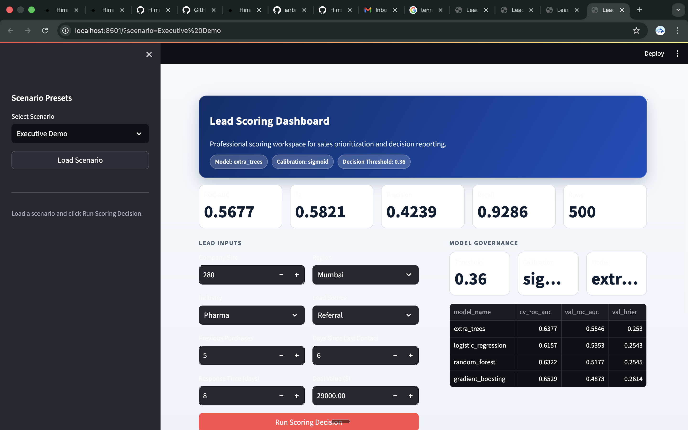

# Lead Scoring AI

A machine learning project that helps sales teams decide which leads to follow first.

This app predicts the chance that a lead will convert (`converted = 1`) and gives:
- conversion probability
- predicted class (`Convert` or `No Convert`)
- priority band (`High`, `Medium`, `Low`)

## Project Goal
Sales teams usually get many leads. This project helps them prioritize leads using data instead of guesswork.

## Dataset
File:
- `data/lead_scoring_logistics_Dataset.csv`

Columns:
- `lead_code` (ID only, not used in model training)
- `company_size`
- `industry`
- `region`
- `prev_purchases`
- `response_time`
- `last_contact`
- `source`
- `deal_value`
- `converted` (target)

## Tech Stack
- Python
- Pandas
- Scikit-learn
- FastAPI
- Streamlit
- Joblib
- Pydantic

Dependencies are listed in:
- `requirements.txt`

## How this project was built (step by step)
1. Read dataset and remove ID column (`lead_code`).
2. Split data into train / validation / test.
3. Apply feature engineering (log features, ratio features, interaction features).
4. Preprocess data:
   - numeric: impute + scale
   - categorical: impute + one-hot encode
5. Train and tune multiple models using `GridSearchCV`.
6. Compare model performance.
7. Calibrate probabilities (`none`, `sigmoid`, `isotonic`) and choose best by Brier score.
8. Optimize classification threshold (not fixed 0.5).
9. Save final artifacts for inference and deployment.
10. Serve with FastAPI and visualize in Streamlit dashboard.

## Models Compared
- Logistic Regression
- Random Forest
- Extra Trees
- Gradient Boosting

Comparison output:
- `artifacts/model_comparison.md`

Current selected model details and metrics:
- `artifacts/metrics.json`

## Project Structure
```text
lead-scoring-ai/
├── api/
│   └── main.py
├── dashboard/
│   └── app.py
├── scripts/
│   ├── train.py
│   ├── smoke_test.py
│   └── capture_screenshots_mac.sh
├── src/lead_scoring/
│   ├── config.py
│   ├── train.py
│   └── inference.py
├── data/
│   └── lead_scoring_logistics_Dataset.csv
├── artifacts/
│   ├── metrics.json
│   └── model_comparison.md
├── assets/screenshots/
│   ├── executive_demo.png
│   ├── cold_prospect.png
│   └── large_slow_account.png
├── requirements.txt
├── pyproject.toml
└── README.md
```

## Setup
```bash
python3 -m venv .venv
source .venv/bin/activate
python -m pip install --upgrade pip setuptools wheel
pip install -r requirements.txt
pip install -e .
```

## Train Model
```bash
python3 scripts/train.py
```

This creates:
- `artifacts/metrics.json`
- `artifacts/model_comparison.md`
- `artifacts/best_model.joblib`

## Run API
```bash
uvicorn api.main:app --reload --port 8000
```

Endpoints:
- `GET /health`
- `GET /model-info`
- `POST /predict`

## Run Dashboard
```bash
streamlit run dashboard/app.py
```

## Dashboard Screenshots

### Executive Demo


### Growth Inbound
Screenshot omitted due capture artifact in this environment.

### Cold Prospect


### Large Slow Account


## Smoke Test
```bash
python3 scripts/smoke_test.py
```

It checks:
- valid input works
- unknown categories do not crash
- invalid input is rejected

## Notes
- This is a full end-to-end ML project (training + API + dashboard).
- Model quality depends on data quality and dataset size.
- Threshold can be changed later for business goals (precision-first or recall-first).
